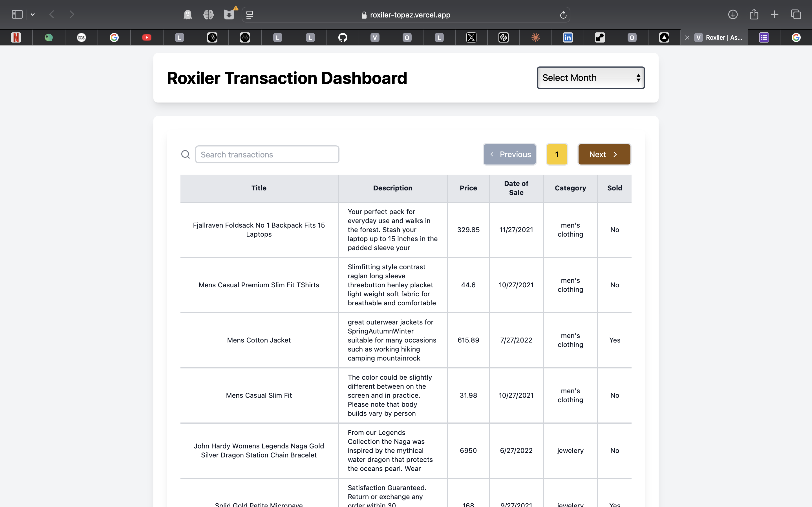
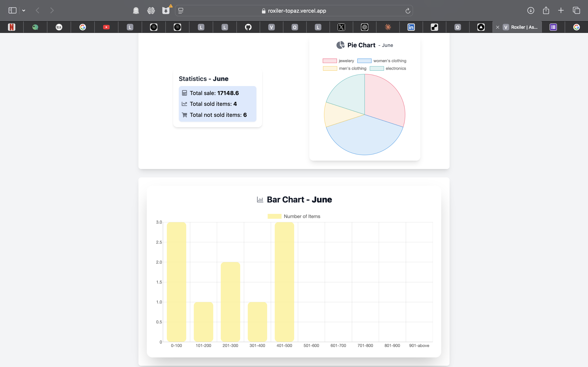

# Roxiler Transaction Dashboard

**Live Demo**: [Visit the live application here!](https://roxiler-topaz.vercel.app)

This web application is designed to manage and visualize transaction data, providing insights through various data visualization tools such as bar charts, pie charts, and statistical views.

## Overview

The Roxiler Transaction Dashboard allows users to view, search, and analyze transaction data through a user-friendly interface. It features real-time search capabilities, responsive design, and interactive data visualizations.

## Features

- **Transaction Management**: View and search transactions based on different criteria such as month, title, description, and price.
- **Data Visualization**: Analyze transaction data using bar charts and pie charts.
- **Real-time Search**: Transactions can be searched in real-time, providing instant feedback as you type.
- **Responsive Design**: Fully responsive web design that works on both desktop and mobile devices.

## Technology Stack

- **Frontend**: React, Vite, TailwindCSS, Recharts, Chart.js
- **Backend**: Node.js, Express, MongoDB with Mongoose
- **API Testing**: Axios for API requests
- **Version Control**: Git

## Screenshots




## Development Setup

To set up the project locally, follow these steps:

1. Clone the repository:
   ```bash
   git clone https://github.com/bunnysayzz/ROXILER.git
   cd ROXILER
   ```

2. Install dependencies:
   ```bash
   npm install
   ```

3. Start the development server:
   ```bash
   npm run dev
   ```

4. Open `http://localhost:5173` in your browser to view the application.

## Additional Links

- **Portfolio**: [Azharuddin's Portfolio](https://imazhar.vercel.app/)
- **LinkedIn**: [Azharuddin on LinkedIn](https://www.linkedin.com/in/azharuddindev)

For more information or to view the source code, visit the [GitHub repository](https://github.com/bunnysayzz/ROXILER.git).